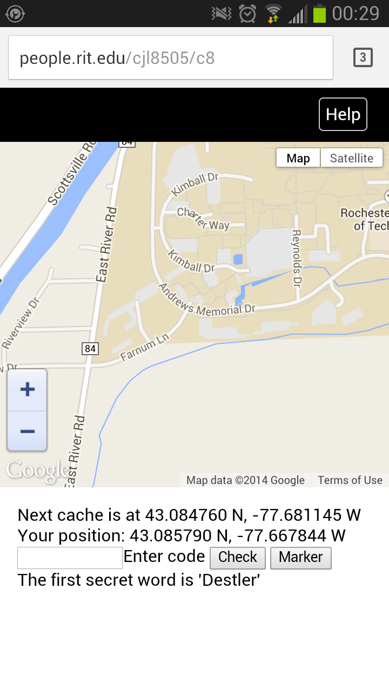

Choose Your Own Tour
===

Combine the interactive outdoor experience of geocaching with the endless
possibilities of choose your own adventure games. Allow visitors to choose
their own tours and experience new places in a unique way.

Extensible
===
Paths and map options are defined in JSON, for easy extensions of the concept
to new places.

Responsive
===
Works on desktop and mobile. Uses HTML5 to access the built-in GPS, on
devices that support it.